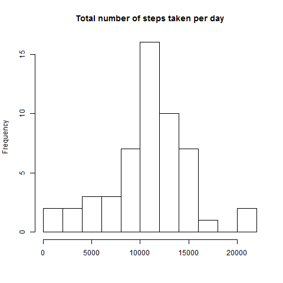
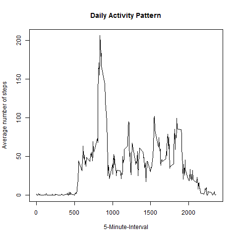
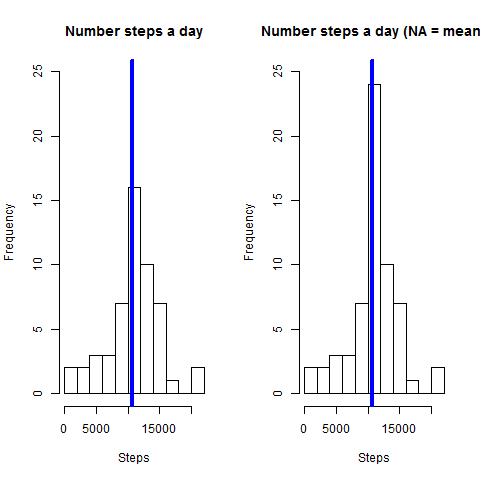
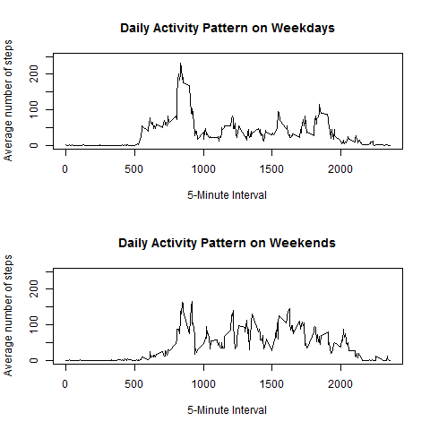

##Loading and preprocessing the data
-------------------------------------------------
* set working directory
```{r echo=TRUE}
setwd('/Users/Joris/Documents/Reproducable research');
```
* Unzip file en read
```{r echo=TRUE}
filename <- unzip("activity.zip")
activity <- read.csv(filename, stringsAsFactors = FALSE)
str(activity)
```
* Put Dates in right format.
```{r echo=TRUE}
activity$date <- as.Date(activity$date)
str(activity)
```
* Missing values in file
```{r echo=TRUE}
table(is.na(activity$steps))
```
##What is mean total number of steps taken per day?
I need a file without missing values. There are 2304 missing values, that will be excluded temporarily from our analysis. The dataset called “activity_comp” is created for this reason.

* Missing values in file
```{r echo=TRUE}
activity_comp<-activity[which(!is.na(activity$steps)),]
```
It's a 5-minute interval timeslot, so let's aggregate the data by day. 
```{r echo=TRUE}
daysteps<-tapply(activity_comp$steps, activity_comp$date, sum)
```
Total number of steps taken for each day of October and November (total 53 days)
Make a histogram of the total number of steps taken each day.
```{r echo=TRUE}
hist(daysteps,10, main = "Total number of steps taken per day", xlab = "")


mean(daysteps)
median(daysteps)
```
##What is the average daily activity pattern?
```{r echo=TRUE}
dailyact<-tapply(activity_comp$steps, activity_comp$interval, mean)
plot(y = dailyact, x = names(dailyact), type = "l", xlab = "5-Minute-Interval", main = "Daily Activity Pattern", ylab = "Average number of steps")
```



The maximum average number of steps throughout the days is 835 with 206.1698 steps.
```{r echo=TRUE}
dailyact[dailyact==max(dailyact)]
```
#Imputing missing values
```{r echo=TRUE}
sum(is.na(activity$steps))
```
Calculate and report the total number of missing values in the dataset (i.e. the total number of rows with NAs)
```{r echo=TRUE}
sum(is.na(activity))
```
Take the mean for all NA values. Create a new dataset that is equal to the original dataset but with the missing data filled in.
```{r echo=TRUE}
activiteit_aangepast <- activity
activiteit_aangepast[which(is.na(activiteit_aangepast$steps)),1]<-dailyact[as.character(activiteit_aangepast[which(is.na(activiteit_aangepast$steps)),3])]
```
No missing values are now in the new dataset: 
```{r echo=TRUE}
sum(is.na(activiteit_aangepast))
```
Same histogram, that we made in the beginning. 
```{r echo=TRUE}
daysteps_new<-tapply(activiteit_aangepast$steps, activiteit_aangepast$date, sum)
par(mfrow=c(1,2))
hist(daysteps,10, main = "Number steps a day", xlab = "Steps", ylim =c(0, 25))
abline(v = median(daysteps), col = 4, lwd = 4)
hist(daysteps_new,10, main = "Number steps a day (NA = mean)", xlab = "Steps",ylim =c(0, 25))
abline(v = median(daysteps_new), col = 4, lwd = 4)
```

Calculate the median and the mean of the filled in dataset
```{r echo=TRUE}
mean(daysteps_new)
median(daysteps_new)
mean(daysteps_new)-mean(daysteps)
median(daysteps_new)-median(daysteps)
```
#Are there differences in activity patterns between weekdays and weekends?

Create a factor variable in the dataset with two levels – “weekday” and “weekend” indicating whether a given date is a weekday or weekend day.
```{r echo=TRUE}
activiteit_aangepast$wd<-weekdays(activiteit_aangepast$date)
activiteit_aangepast$fwd<- as.factor(c("weekend", "weekday"))
activiteit_aangepast[activiteit_aangepast$wd == "zondag" | activiteit_aangepast$wd == "zaterdag" ,5]<- factor("weekend")
activiteit_aangepast[!(activiteit_aangepast$wd == "zondag" | activiteit_aangepast$wd == "zaterdag"),5 ]<- factor("weekday")
```
Create two aggregated arrays for the total number of steps taken per 5-minyute time interval for weekdays and weekends.
```{r echo=TRUE}
activiteit_aangepast_wknd <- subset(activiteit_aangepast, fwd == "weekend") 
activiteit_aangepast_week <- subset(activiteit_aangepast, fwd == "weekday")
dailyact_wknd<-tapply(activiteit_aangepast_wknd$steps, activiteit_aangepast_wknd$interval, mean)
dailyact_week<-tapply(activiteit_aangepast_week$steps, activiteit_aangepast_week$interval, mean)
par(mfrow=c(2,1))
plot(y = dailyact_week, x = names(dailyact_week), type = "l", xlab = "5-Minute Interval",  main = "Daily Activity on Weekdays", ylab = "Average number of steps", ylim =c(0, 250))
plot(y = dailyact_wknd, x = names(dailyact_wknd), type = "l", xlab = "5-Minute Interval", main = "Daily Activity on Weekends", ylab = "Average number of steps", ylim =c(0, 250))```

